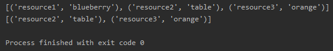
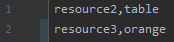

# Crossfile
Abstract away some logic when dealing with `name,value` csv files  

## Overview
There are 4 functions available for use:
```
link(filename: str)
get(identifier: str)
post(identifier: str, resource: any)
delete(identifier: str)
```

## Usage
Import the module
```python
import crossfile
```
Instantiate the class
```python
cf = crossfile.Crossfile('database.txt')
```
Use the methods
```python
cf.post('a', 'foo')
cf.post('b', 'bar')
print(cf.get())
cf.delete('a')
print(cf.get())
```

## Example
[Example](example.py)
```python
import crossfile

cf = crossfile.Crossfile('database.txt')
cf.post('resource1', 'blueberry')
cf.post('resource2', 'table')
cf.post('resource3', 'orange')
print(cf.get())
cf.delete('resource1')
print(cf.get())
```

**Output**:  
  
database.txt:  


## Notes
All identifiers and resources are converted into strings.